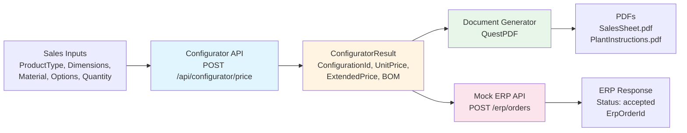

# Reviewer Start Here

**Purpose:** Portfolio demonstration of manufacturing business-systems engineering: product configurator, automated document generation, and ERP integration with deterministic traceability.

## Executive Summary

Manufacturing organizations face fragmentation between product configuration, document generation, and ERP order entry, creating errors, delays, and lost revenue from pricing mistakes and manufacturing rework. This portfolio builds a unified flow: a RESTful configurator API that accepts product specifications and returns deterministic configuration IDs, pricing with quantity discounts, and bill-of-materials. The configurator output feeds a document generator producing PDF sales sheets and plant manufacturing instructions, while the same configuration data flows to a mock ERP API that validates order payloads and returns ERP order IDs, demonstrating end-to-end traceability from quote to order. Key outcomes include deterministic configuration IDs (SHA-256 based, format CFG-xxxxxxxxxxxx) enabling quote-to-order linking, programmatic validation enforcing business rules, automated PDF generation eliminating manual workflows, strict ERP payload validation preventing data entry errors, and documented change control with versioning strategies and maintenance protocols. This architecture mirrors workflows found in HVAC and industrial manufacturing organizations where product configurators generate quotes that become manufacturing orders routed through ERP systems with traceable configuration IDs linking sales quotes to production BOMs.

## Architecture Diagram

## Recommended Review Order (60 Seconds)

### Step 1: Read PORTFOLIO_OVERVIEW.pdf
[PORTFOLIO_OVERVIEW.pdf](PORTFOLIO_OVERVIEW.pdf): 1–2 page executive summary for non-technical reviewers

### Step 2: Run the demo (links below)
See [README.md](README.md) for overview and [SETUP_COMMANDS.md](SETUP_COMMANDS.md) for exact terminal commands. The configurator API runs on `http://localhost:5000` with Swagger UI at `/swagger`. The mock ERP API runs on `http://localhost:5002`.

### Step 3: Inspect targeted code areas
- **Pricing Logic:** [`02_product_configurator_app/Configurator.Core/Pricing/PricingEngine.cs`](02_product_configurator_app/Configurator.Core/Pricing/PricingEngine.cs) - Base price calculation, product/material multipliers, option adders, quantity discounts, deterministic ConfigurationId generation
- **Validation:** [`02_product_configurator_app/Configurator.Core/Validation/Validator.cs`](02_product_configurator_app/Configurator.Core/Validation/Validator.cs) - Dimension bounds, quantity limits, required field checks
- **API Endpoints:** [`02_product_configurator_app/Configurator.API/Controllers/ConfiguratorController.cs`](02_product_configurator_app/Configurator.API/Controllers/ConfiguratorController.cs) - POST /api/configurator/price and /validate with structured logging
- **PDF Generation:** [`03_document_generator/DocumentGenerator.Core/DocumentGenerator.cs`](03_document_generator/DocumentGenerator.Core/DocumentGenerator.cs) - QuestPDF implementation for SalesSheet and PlantInstructions
- **ERP Integration:** [`04_mock_erp_integration/MockErp.API/Controllers/ErpController.cs`](04_mock_erp_integration/MockErp.API/Controllers/ErpController.cs) and [`04_mock_erp_integration/MockErp.API/Models/ErpOrderRequest.cs`](04_mock_erp_integration/MockErp.API/Models/ErpOrderRequest.cs) - Order validation, ConfigurationId format checking, ERP order ID generation

## Where to Look (Technical)

### Configurator Pricing & Validation
- **Pricing Engine:** [`02_product_configurator_app/Configurator.Core/Pricing/PricingEngine.cs`](02_product_configurator_app/Configurator.Core/Pricing/PricingEngine.cs)
  - Base price from volume, product/material multipliers, option adders, minimum price enforcement, quantity discount breaks
  - Deterministic ConfigurationId via SHA-256 hash of normalized request fields
- **Validation:** [`02_product_configurator_app/Configurator.Core/Validation/Validator.cs`](02_product_configurator_app/Configurator.Core/Validation/Validator.cs)
  - Numeric bounds (6-120 inches for dimensions, 1-1000 for quantity), required field validation

### API Endpoints
- **Configurator Controller:** [`02_product_configurator_app/Configurator.API/Controllers/ConfiguratorController.cs`](02_product_configurator_app/Configurator.API/Controllers/ConfiguratorController.cs)
  - POST /api/configurator/price returns ConfiguratorResult with ConfigurationId, pricing, BOM
  - POST /api/configurator/validate returns 200 OK or 400 with error details
  - Structured logging includes ConfigurationId on successful pricing

### PDF Generation
- **Document Generator:** [`03_document_generator/DocumentGenerator.Core/DocumentGenerator.cs`](03_document_generator/DocumentGenerator.Core/DocumentGenerator.cs)
  - GenerateSalesSheet(): ConfigurationId, product details, options, unit/extended price, created timestamp
  - GeneratePlantInstructions(): BOM table with codes/descriptions/quantities, routing flags (ExpressBuild detection)

### ERP Schema & Validation
- **Order Model:** [`04_mock_erp_integration/MockErp.API/Models/ErpOrderRequest.cs`](04_mock_erp_integration/MockErp.API/Models/ErpOrderRequest.cs)
  - Data annotations for required fields, range validation (totalPrice >= 0, quantity > 0)
- **ERP Controller:** [`04_mock_erp_integration/MockErp.API/Controllers/ErpController.cs`](04_mock_erp_integration/MockErp.API/Controllers/ErpController.cs)
  - ConfigurationId format validation (CFG-xxxxxxxxxxxx regex), items list non-empty check
  - Returns 202 Accepted with ERP order ID or 400 BadRequest with validation errors

## Documentation Highlights

### Legacy System Analysis
- **Overview:** [`01_legacy-system-analysis/legacy_overview.md`](01_legacy-system-analysis/legacy_overview.md) - Excel/Word/SAP silos, manual processes, version control issues
- **Failure Points:** [`01_legacy-system-analysis/failure_points.md`](01_legacy-system-analysis/failure_points.md) - Critical failure points: spreadsheet versioning, manual data entry errors, document generation bottlenecks, lack of validation, no audit trail, ERP integration gaps

### System Documentation
- **User Guide:** [`05_system_documentation/user_guide.md`](05_system_documentation/user_guide.md) - API endpoints, request/response examples, product types, materials, options, quantity discounts, validation rules, curl examples
- **Maintenance Protocol:** [`05_system_documentation/maintenance_protocol.md`](05_system_documentation/maintenance_protocol.md) - Build/run instructions, code organization, modifying pricing rules, adding product types/materials/options, PDF template changes, logging configuration
- **Versioning Strategy:** [`05_system_documentation/versioning_strategy.md`](05_system_documentation/versioning_strategy.md) - API versioning policy, configuration ID stability, code versioning, migration strategy for breaking changes

### Future State Design
- **Architecture:** [`06_future_state_design/single_platform_architecture.md`](06_future_state_design/single_platform_architecture.md) - Unified platform design: configuration service, document generation service, order management service, user management, data persistence, SAP integration, security, scalability, deployment architecture
- **Migration Strategy:** [`06_future_state_design/migration_strategy.md`](06_future_state_design/migration_strategy.md) - 6-month phased migration plan, data migration approach, integration strategy, training plan, rollback procedures, success metrics

### Order Flow
- **Process Documentation:** [`04_mock_erp_integration/order_flow.md`](04_mock_erp_integration/order_flow.md) - End-to-end order flow from configuration creation through ERP submission, data consistency, error handling, logging and audit trail

